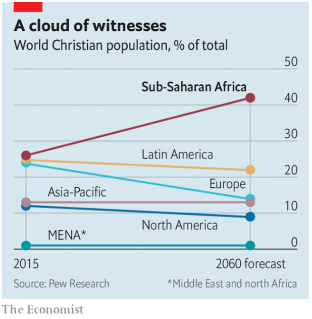
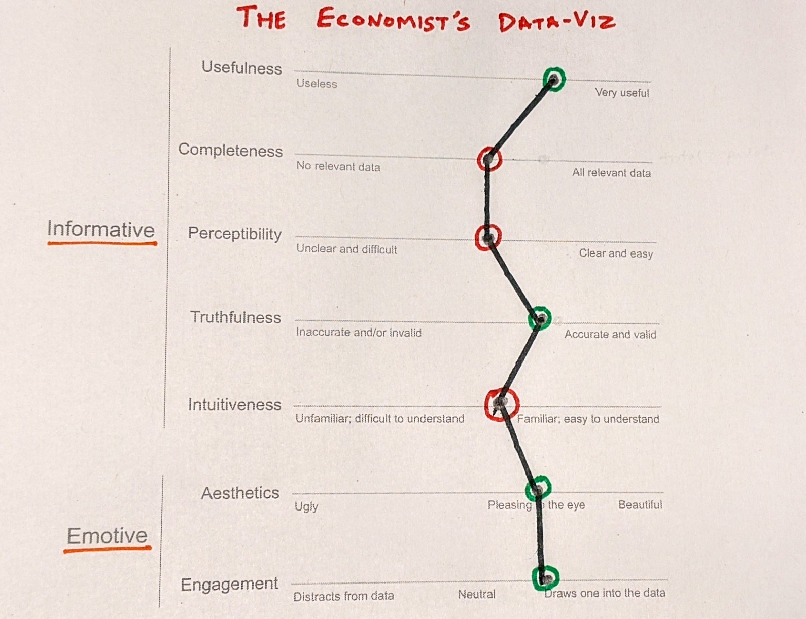
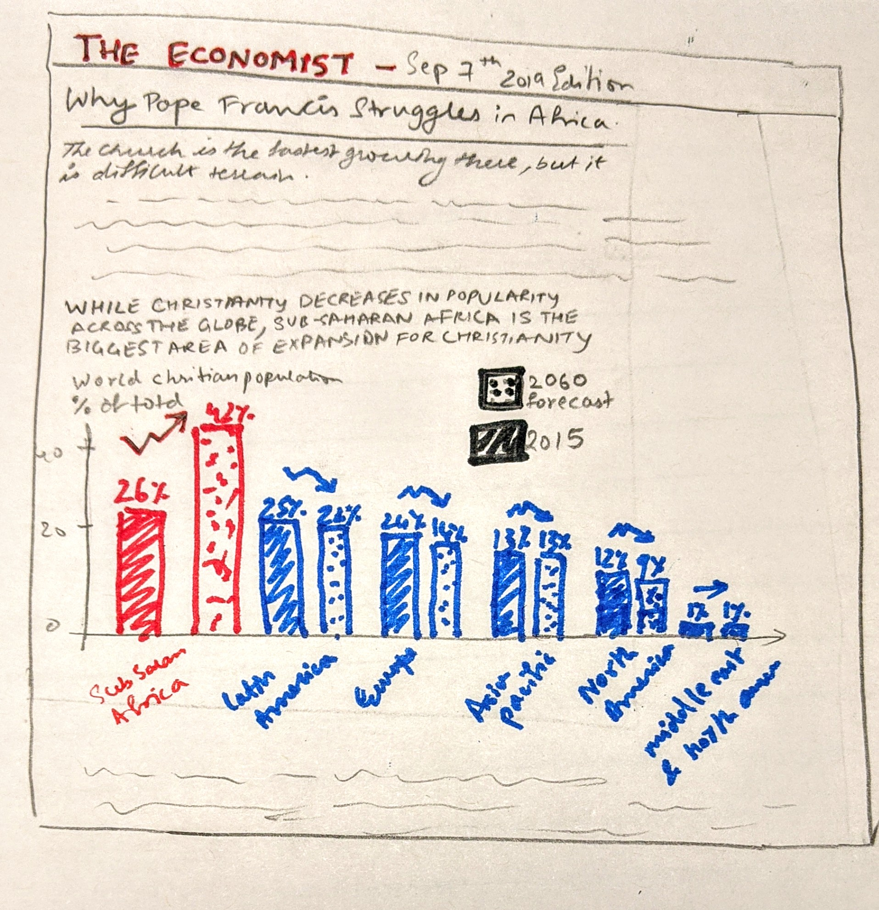
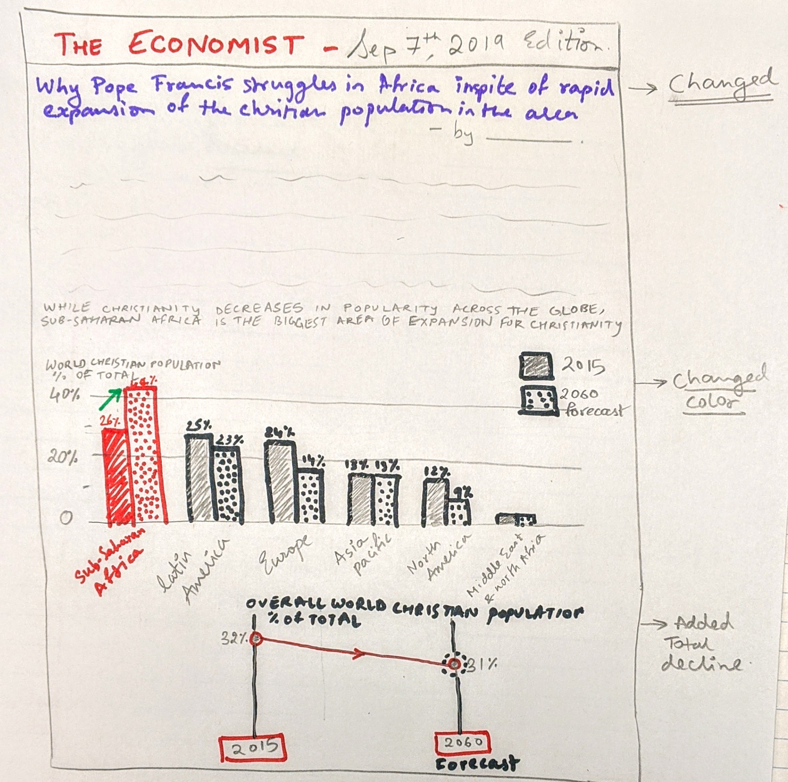
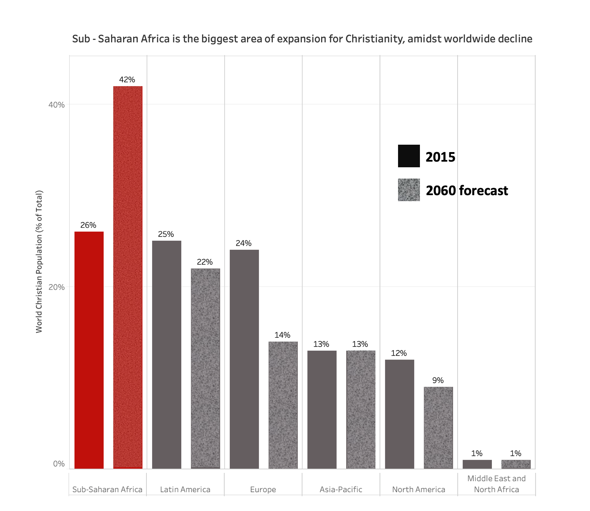
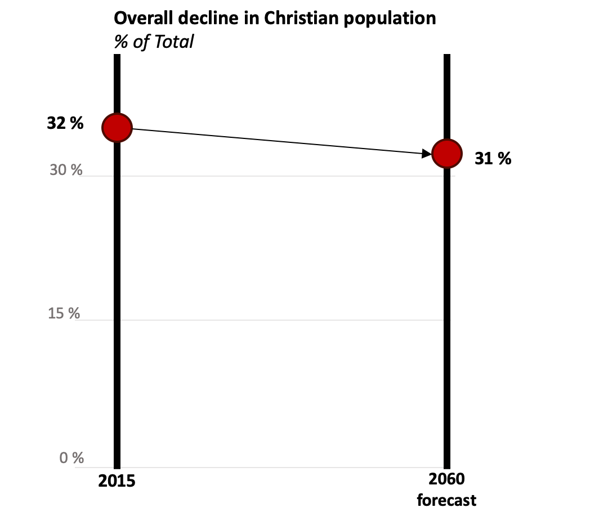

# 1 : Data-Viz chosen from an article in The Economist

Article: [Why Pope Francis struggles in Africa](https://www.economist.com/middle-east-and-africa/2019/09/07/why-pope-francis-struggles-in-africa)

DataL: [Google Sheet containing data](https://docs.google.com/spreadsheets/d/1pyzSom5sEEfFfPO4ZvZyEYLYA4pjxNGf5SlrITmuuJI/edit?usp=sharing)

@Source: [Pew Research](https://www.pewforum.org/2015/04/02/religious-projections-2010-2050/)

**Background:**
I chose this data visualization from The Economist because of its simplicity. The article talks about how the locus of Christianity is moving downward in many parts of the world while Sub-Saharan Africa represents the faith's greatest hope. The focus of the article, however, is how the Christian-Muslim conflict sputtering across west Africa is hindering with the Pope's plans to visit the continent. The article cites findings of Pew, an American research institute, which indicate that the share of the world’s Christians who live in sub-Saharan Africa will surge to 42% by 2060, up from 26% in 2015. This is precisely what the visualization I have chosen for this exercise represents. It highlights how hristianity would be destined to fall rather swiftly behind Islam as the world’s most popular faith if not for it's adoption in Sub-Saharan Africa.

# 2. CRITIQUE

## Reference

Few, Stephen. “Data Visualization Effectiveness Profile,” 2017, 11.
http://www.perceptualedge.com/articles/visual_business_intelligence/data_visualization_effectiveness_profile.pdf

## 1. Describe your overall observations about the data visualization here. What stood out to you? What did you find worked really well? What didn't? What, if anything, would you do differently?

**Things that stood out:**  
- The **Red line** representing Sub-Saharan Africa draws attention to it immediately which is great.
- The **Chart Title** definitely stood out to me. I had to google what the title implied because I was unaware of it’s significance. In my opinion, the title could have been more self explanatory instead of something so abstract, this will allow the average reader to comprehend it easily.
- The **label** that reads Sub-Saharan Africa aptly conveys that the chart’s main focus is that region.

**What I liked:**   
- Apt use of **color and typography:** I love how the color red and bold text are used to draw the reader’s attention subtly to the main focus of the chart.  

**What I disliked:**   
- **Scattered region labels** make it hard to interpret the chart at first glance.
- **Slope charts** typically work when there are fewer variables, 
- **Overuse of color** is distracting readers from the main focus of the chart, i.e. the increase in the christian population in Sub-Saharan Africa. The other slopes are competing for attention.
- **The Y-Axis ticks** on right causes more eye travel across the chart while interpreting each slope.
- **Actual percentage values** of the points are not printed so it is subject to inaccurate interpretation

**What I would change:**   
- I would align the **region labels**
- **Reduce the use of colors** in the chart so as to draw attention to the slope corresponding to Sub-Saharan Africa	
- Maybe change the **chart type** and use a bar chart to represent the same information
- I would certainly change the **chart title** to make it more informative and less abstract

## 2. Who is the primary audience for this tool? Do you think this visualization is effective for reaching that audience? Why or why not?

Visualizations are made for consumption by readers. It is therefore, really important to understand the need of the Audience and this begins with identifying who the audience is.  According to me, the primary audience for this visualization are the **readers of The Economist**.

According to me I would rate the effictiveness of this visualization as follows:

## 3. Final thoughts: how successful was this method at evaluating the data visualization you selected? Are there measures you feel are missing or not being captured here? What would you change? Provide 1-2 recommendations (color, type of visualization, layout, etc.)

exhastive better than good chart

time 

medium

# 3. WIREFRAMES

# First try

@Source: [Pew Research](https://www.pewforum.org/2015/04/02/religious-projections-2010-2050/)

## Feedback on first iteration:

**Friend 1:**
- "The link between the title of the article and the visualization is not clear. Why would the pope struggle in a place where Christianity is thriving?"
- "It appears as though the % population is not varying in the blue regions. The Fact that the % population of Christians will double in Sub-Saharan Africa is not emphasised enough"
- "Audience: Newspaper readers"
- "Change the title of the article"

**Friend 2:**
- "What is the over all decline in percentage christian population, worldwide?"
- "The chart looks vibrant and is eye catchy, my eyes are drawn to the red bars"
- "Readers of the economist"
- "Change: Scale the bars appropriately"

### What I learned:

- In order to enhance the completeness of this visualization I should include the overall change in population as well.
- Modify the title of the article itself in order to establish a stronger link between the article and the visualization
- Include a chart title that depicts the idea behind the visualization
- Use a more neutral color for the other regions in order to increase emphasis on the Sub-Saharan-African region
------------------------------------------------------------------------------------

# Second try, after incorporating the feedback received

@Source: [Pew Research](https://www.pewforum.org/2015/04/02/religious-projections-2010-2050/)

## Feedback on second iteration:

**Friend 1 (Same as above):**
- "I see the link between the article and the chart now. I like how you used black instead of blue this time around. I would not change anything else."

**Friend 2 (Same as above):**
- "I like how you have included the overall variation in the christian population, worldwide. The chart serves its purpose, I don't think you need to change anything"

### I will go ahead with this version for my final draft!

# New Data Viz

@Source: [Pew Research](https://www.pewforum.org/2015/04/02/religious-projections-2010-2050/)

@Source: [Pew Research](https://www.pewforum.org/2015/04/02/religious-projections-2010-2050/)

The visualization is recreated using the original source data or data that can be found elsewhere. Student has recreated the visualization using one of the tools from class. The new visualization is effective and would pass the critique test well in most areas, and appears to have been designed to address some of the shortcomings identified in the earlier visualization. The content is carefully crafted in positively impacts the interpretation of the data and visualization. Colors support the understanding of information and don't distract from the message.

# SUMMARY

In my opinion, this critiquing method is highly effective. It allows us to dissassemble various aspects of a visualization and gauge its effectiveness holistically. Data visualizations are created with the inten of bringing out the patterns and meaning burried in numeric data. They are designed so that the avergae reader can grasp its meaning easily, without having to sift through it to gather information. The effectiveness of a visualization, therefore, relies heavily on the creator's intention to portray a persuasive narrative as well as the reader's reception of the message. This particular method of critiquing data visualizations takes into account both these aspects and is therefore, a good measure of the effectiveness of a visualization.

Data-Viz is a powerful tool that can be used to persuade readers. They should be informative and provide intellectual stimuli as well as emotive in the sense that it produces a powerful emotional response in the reader. The Data Visualization Effectiveness Profile critiquing method assess visualizations from both perspectives which makes it very effective. What I like most about this is that it allows one to assess visualizations from a reader's perspective.  

Since we analyse a visualtisation using 7 holistic metrics, it helps us identify precisely which area needs enhancement and why a particular visualisation isn't quite working. This process helps in the refinement process since we know exactly what to fix in order to make a data-viz more effective.

<- [Return to my Portfolio page](/README.md)
