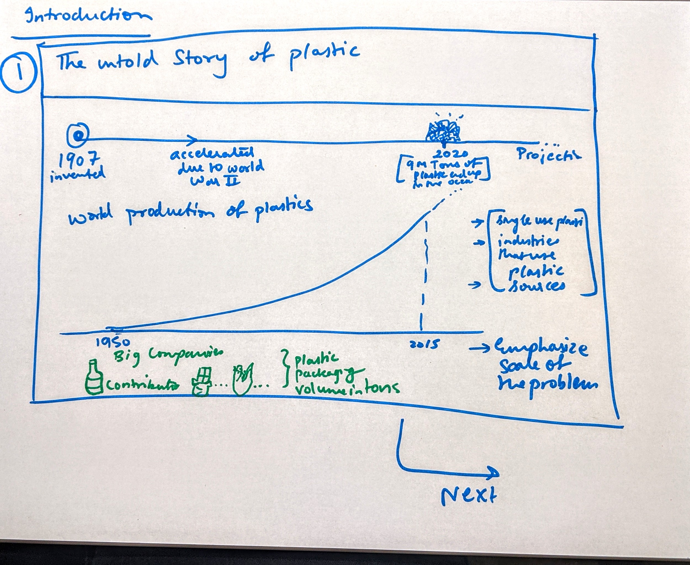
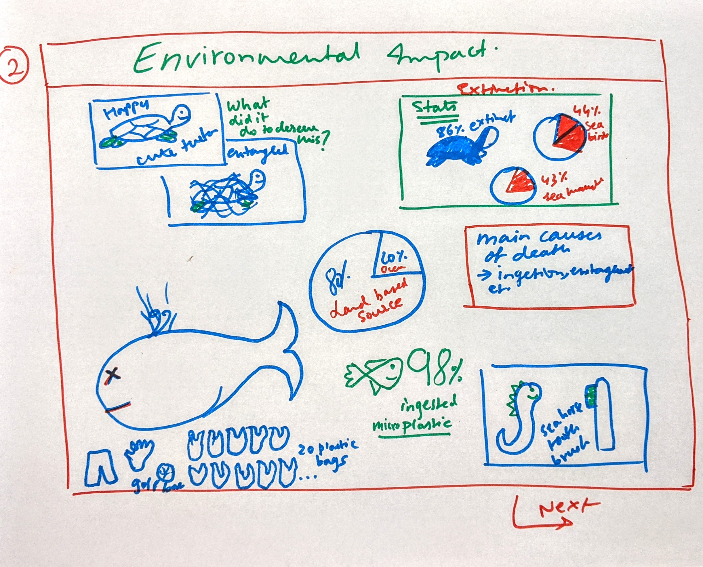
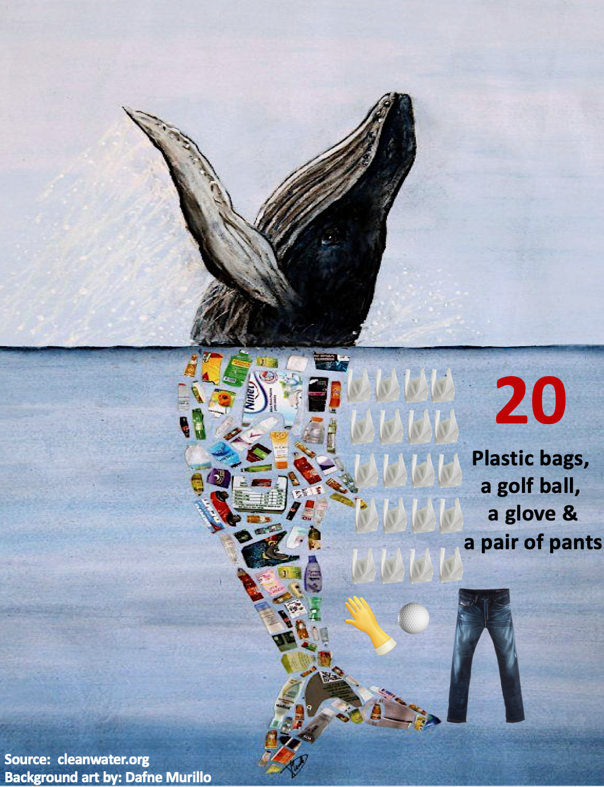
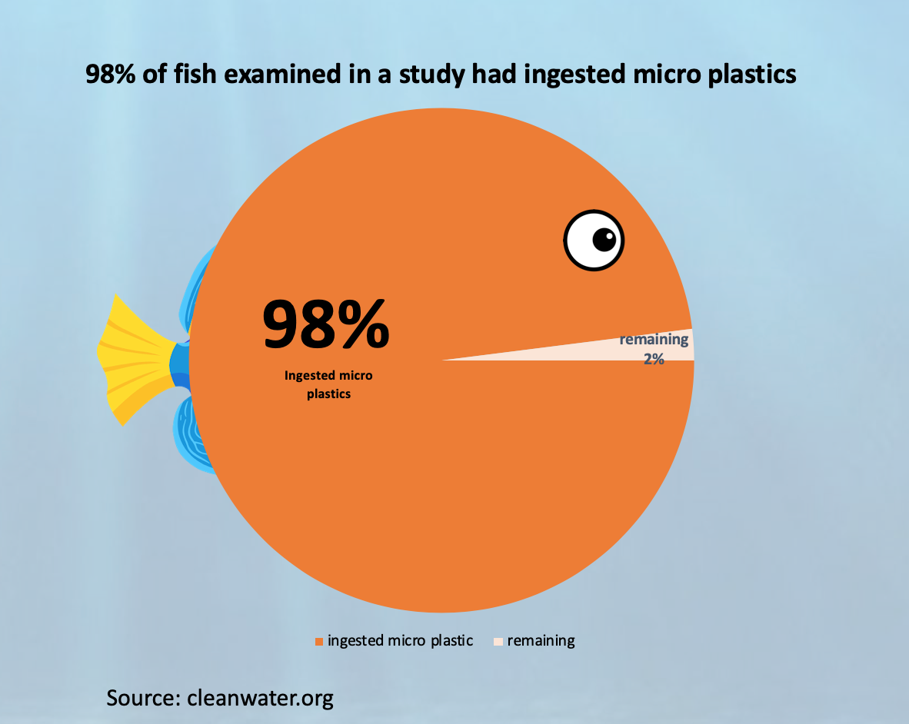
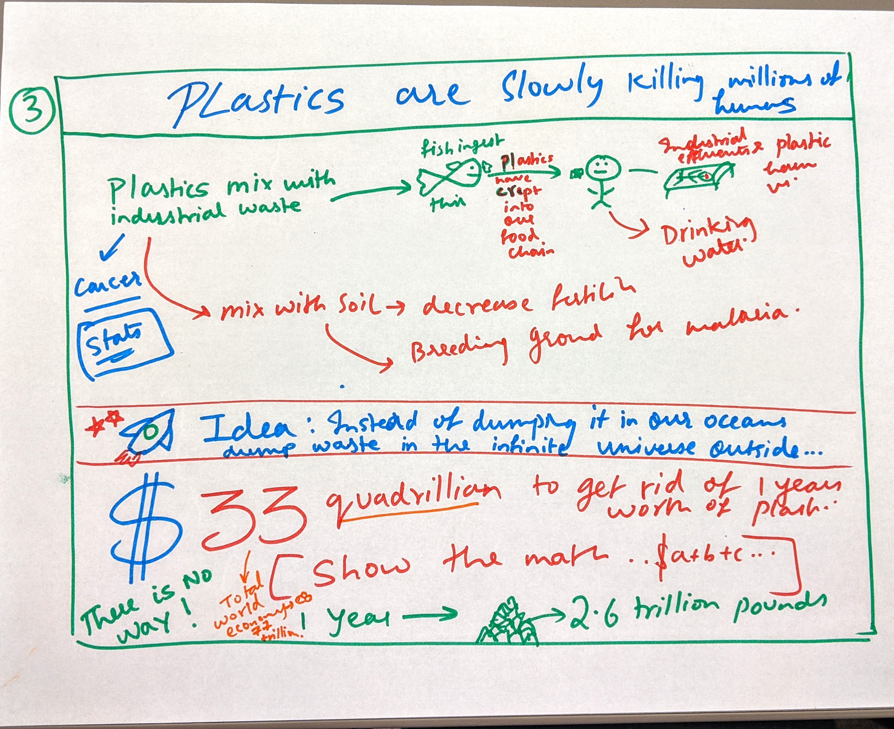
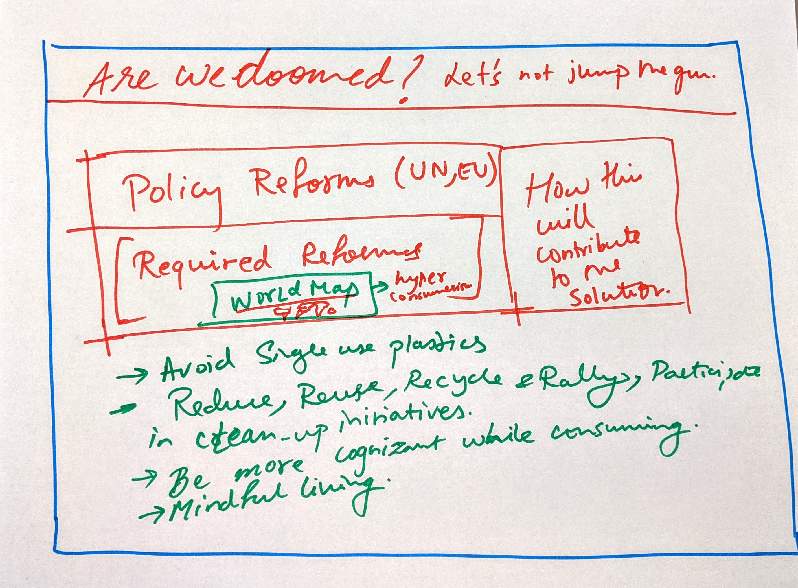
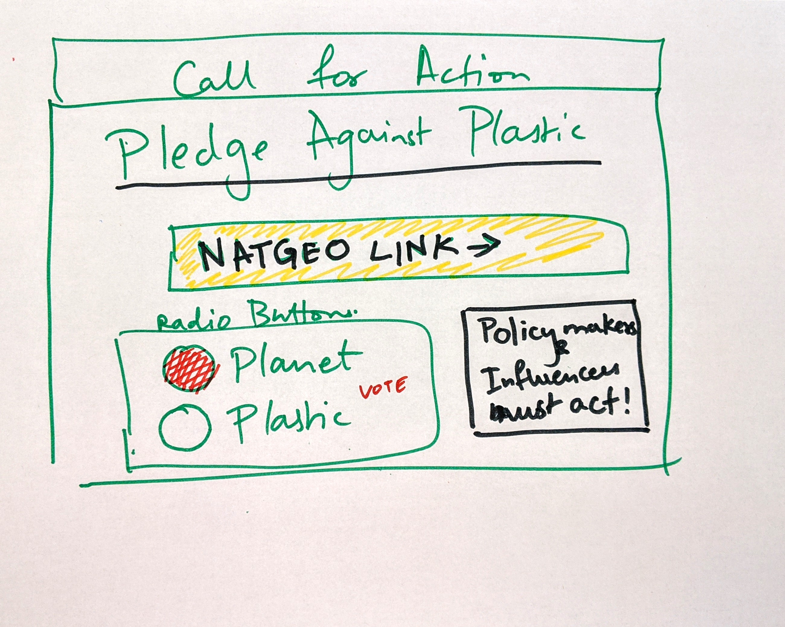

# Part II: Wireframes, storyboards, moodboards and user research

I will rely on the wireframes I created in Part - I  to garner feedback. Once I receive feedback I will incorporate the changes into my revised wireframes which I will use as basis for my final project. Further, visualizations are an integral part of my story and in part 2, I will plot all my visualizations so that I can refine them using the feedback I get.

I will design my revised wireframes on powerpoint because I seek a little more clarity and specificity than what balsamiq has to offer.

# (1) Wirefames / storyboard for user feedback

Here are my intial wireframes:
 
**1. Introduction: The Story of Plastic**

**2. Environmental Impact**

charts corresponding to this section : 

1. Contents found inside the dead whale 

2. Study conducted showed that 98% of the fish sampled had ingested microplastics

**3. Plastics are slowly killing Millions of Humans**

**4. Let us reflect on our consumption**

**5. Policy reforms required, the world scenario and simple steps we can take to save the planet**

**5. Call for Action - Pledge against Plastic!**

# (2) Creation of a user research protocol and completion of at least three interviews

## User Research Protocol

### Target Audience

The target audience for my story is everyone, young and old. The purpose of this project is to raise awareness and my call to action is for people to pledge against plastic. For the sake of this project, however, I would like to target my efforts on convincing millenials. This is because I firmly believe that young bloods have the willingness to change and can make a significant contribution to making the world a better place.

### Approach

As mentioned earlier, since I am going to focu on millenials for the pupropse of this project, I will be interviewing some of my peers at Heinz to garner valuable feedback. 

My goal is to assess the effectiveness of my story and visualizations using the following criteria:

- **User Engagement**
  - Do the users feel drawn towards the topic and does it instill the kind of emotions I expected to see in my story arc (i.e, did they feel introspective, empathetic, informed, interested, intrigued and empowered through the course of this engagement).

- **Flow of the storyline**
  - Do people think the story is cohesive and flows well?
  - Is it apt in leading the audience where I wish to take them
  
- **Completeness of the story**
  - Does the stroy have a well defined start and end?
  - Do people feel like something is missing?
  
- **Aesthetics of the imagery and visualization**
  - Are the visualizations attractive enough to capture the audience's interest
  
- **How many of them actually felt the need to change**
  - How many will finally take the pledge against plastic

I plan to give my interviewees some time to look at my intial wireframes and story board and once they have, I will ask them a set of questions to gague the efficacy of my work. I expect each interview to last about 10 minutes in total. The questions are listed below in my interview script. I do not intend on giving them a background of my work before these interviews because I want to see whether my story board is communicating the right message to the audience. I'll be taking notes throughout the interview and will make sure not to influence the interviewee's thoughts in any way.

### Interview Script

### Findings

Your user research protocol should clearly identify the following: 

a. the target audience you hope to reach with your story; 
b. your approach to identifying representative individuals to interview; 
c. your interview script; 
d. the findings from your interviews; and 
e. changes you implemented to your sketches, storyboards and wireframes to address the issues identified.

### 

# (3) Revised wireframes / visualizations / storyboards based on what you heard

<- [Click here to go back to Part 1](/final_project_shreya.md)
