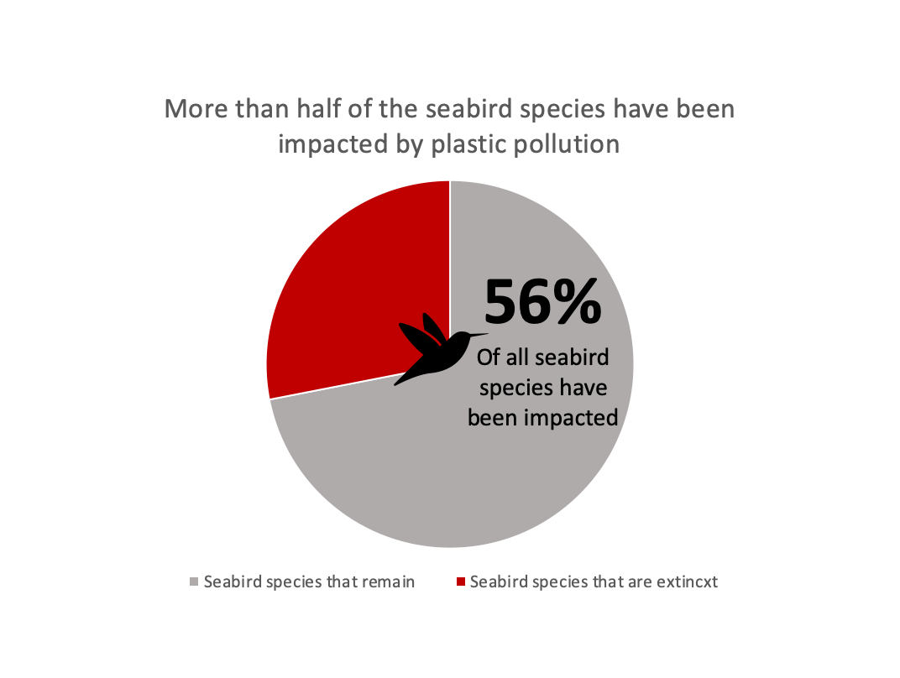
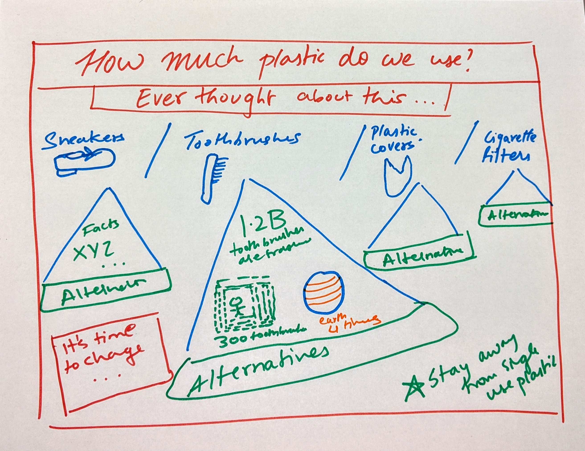
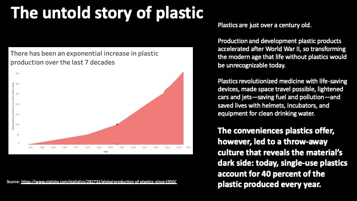

# Part II: Wireframes, storyboards, moodboards and user research

I will rely on the wireframes I created in Part - I  to garner feedback. Once I receive feedback I will incorporate the changes into my revised wireframes which I will then use as a basis for my final project. Further, visualizations are an integral part of my story and in part 2, I will plot all my visualizations so that I can refine them using the feedback I get.

I intend to design my revised wireframes on PowerPoint because I seek a little more clarity and specificity than what Balsamiq has to offer.

(#Note: This project is easier to view on a mobile device)

# (1) Wirefames / storyboard for user feedback

Here are my initial wireframes:
 
**1. Introduction: The Story of Plastic**

charts corresponding to this section : 

Source: https://www.statista.com/statistics/282732/global-production-of-plastics-since-1950/
 

**2. Environmental Impact**

charts corresponding to this section : 

1. Contents found inside the dead whale 

2. Study conducted showed that 98% of the fish sampled had ingested microplastics

**3. Plastics are slowly killing Millions of Humans**

**4. Let us reflect on our consumption**

charts corresponding to this section : 

1. 

**5. Policy reforms required, the world scenario and simple steps we can take to save the planet**

**5. Call for Action - Pledge against Plastic!**

------------------------------------------------------------------------------------------------------------------------------

# (2) Creation of a user research protocol and completion of at least three interviews

## User Research Protocol

### Target Audience

The target audience for my story is everyone, young and old. The purpose of this project is to raise awareness and my call to action is for people to pledge against plastic. For the sake of this project, however, I would like to target my efforts on convincing Millenials. This is because I firmly believe that young bloods have the willingness to change and can make a significant contribution to making the world a better place.

### Approach

As mentioned earlier, since I am going to focus on Millenials for the purpose of this project, I will be interviewing some of my peers at Heinz to garner valuable feedback. 

My goal is to assess the effectiveness of my story and visualizations using the following criteria:

- **User Engagement**
  - Do the users feel drawn towards the topic and does it instill the kind of emotions I expected to see in my story arc (i.e, did they feel introspective, empathetic, informed, interested, intrigued and empowered through the course of this engagement).

- **Flow of the storyline**
  - Do people think the story is cohesive and flows well?
  - Is it apt in leading the audience where I wish to take them
  
- **Completeness of the story**
  - Does the stroy have a well defined start and end?
  - Do people feel like something is missing?
  
- **Aesthetics of the imagery and visualization**
  - Are the visualizations attractive enough to capture the audience's interest
  
- **How many of them actually felt the need to change**
  - How many will finally take the pledge against plastic

I plan to give my interviewees some time to look at my initial wireframes and story board and once they have, I will ask them a set of questions to gauge the efficacy of my work. I expect each interview to last about 10 minutes in total. The questions are listed below in my interview script. I do not intend on giving them a background of my work before these interviews because I want to see whether my story board is communicating the right message to the audience. I'll be taking notes throughout the interview and will make sure not to influence the interviewee's thoughts in any way.

### Interview Script

#### Introduction : 

Hi, I'd like your help in refining my website, I have drawn some initial wireframes and have arranged them in the order they would appear in my final project. These include some visualizations as well as text. I seek honest feedback from you in order to refine these. The final wireframes will form the basis for my website and hence need to be really effective. Please take a look at the wireframes before we can begin this interview.

**1. Could you summarize this story for me in about a sentence or two?**

**2. Was there any part in the story where you felt a slight disconnect from the rest?**

**3. Is there some information, you thought, was lacking? If so what would you have liked to see?**

**4. Are all the visualizations appealing and clear?**

**5. What was the call to action and does that resonate with you?**

**6. Would you pledge against plastic?**

**7. What was your favourite visualization**

**8. On a scale of 1 to 5 how would you rank the effectiveness of this story?**

Thanks, I really appreciate you for taking the time to help me out. Your honest feedback really helps and I will incorporate the changes you've suggested into my final draft.

### Responses

### Findings

- Nobody understood what the pledge is! :(
- The visualizations seem to be working and were widely appreciated. The first visualization on the exponential rise in plastic production can be made better - title and select values should be mentioned
- Story line needs refinement - people did not think the policy part was relevant, however, they sought more information on what they can do to help
- Need to brainstorm more on the solutions that I can provide to the audience
- The call to action is also not very clear and needs to be elaborated

------------------------------------------------------------------------------------------------------------------------------

# (3) Revised wireframes / visualizations / storyboards based on what you heard

The following are key elements that I wish to highlight in my presentation

- **Title slide/page**

- **Increased the font size of the title and made it more clear**

- **This graph depicts the yearly plastic packaging contributions of some big companies, the bar colors correspond to the brand color**

- **Talks about how the plastic reaches the ocean and set the stage for the effect on marine life**

- **Impact on marine wildlife**

- **Amount of plastic found in a dead whale is saddening**

- **Lifetime of plastic items**

- **Got rid of the policy changes**

- **Intend on doing more research on what people can do to reduce plastic pollution in addition to taking National Geographic's pledge. I will include this in my final draft.**

- **Added more information about the pledge based on user feedback since this was the most common feedback received**

- **Call to action**

------------------------------------------------------------------------------------------------------------------------------

<- [Click here to go back to Part 1](/final_project_shreya.md)

->[Click here to go back to Part 1](final_project_part_3_4_shreya.md)
