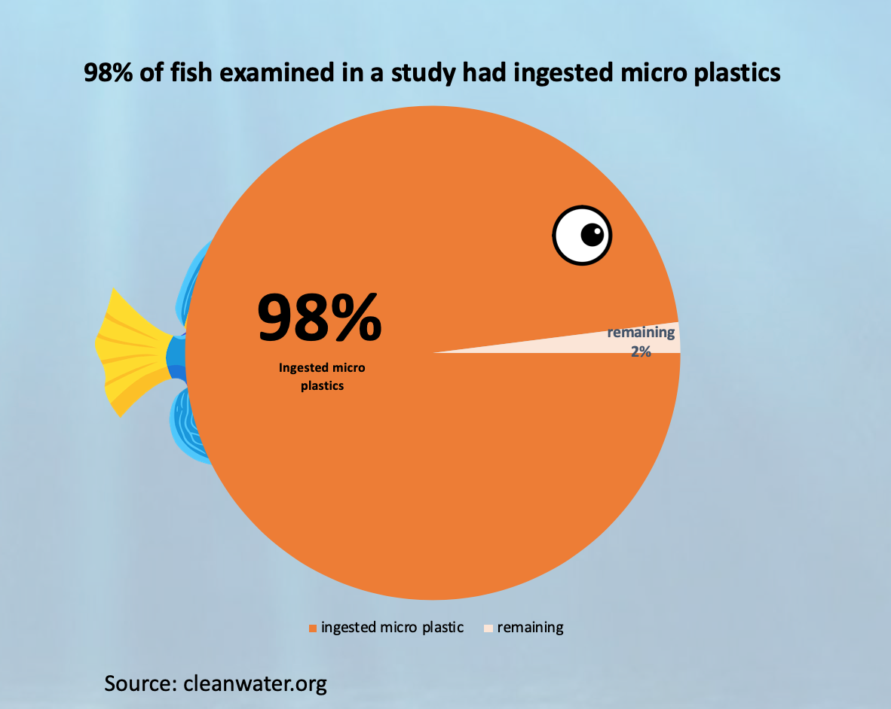
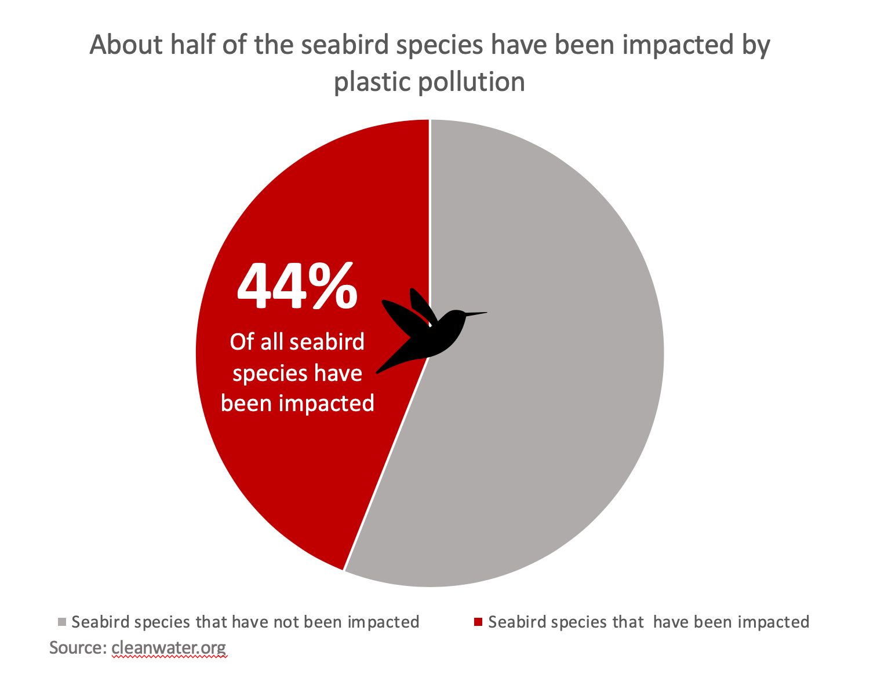
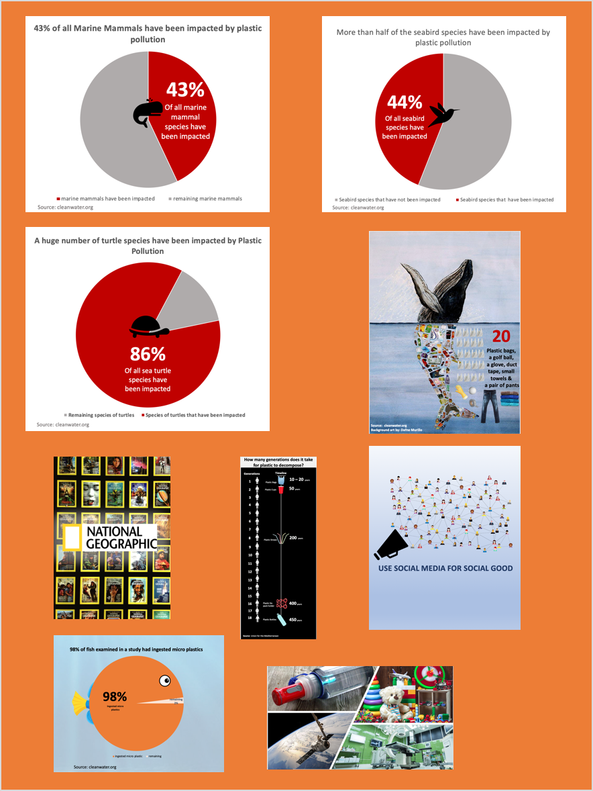

# Part III: The final deliverable

## Intended audience

As mentioned in [part 1](/final_project_shreya.md), the intended audience for my story is **people from all walks of life who are willing to make small changes to their lifestyles in order to contribute towards crafting a better future.** Since I have had the privilege of sharing this class at Heinz with future policy makers and influencers. Therefore, I would like to take this opportunity to shed light on the rampant problem of plastic pollution so that we can collectively work towards finding a fix to this issue that is claiming innocent lives, globally. **In order to alleviate this problem, we are going to require policy reforms but before all that, we have to take small steps and make immediate lifestyle changes as citizens of this planet to do our bit. This begins by understanding the problem and the fact that our contribution is an integral part of the solution.**

The final deliverable is a result of numerous iterations based on peer feedback. Since these final visualizations have gone through three rounds of refinement, they seem to chime well with the audience now. I realised through this process that what we perceive is not what others perceive something as.

In order to extend the reach of my work, I've kept the visualizations simple and easy to interpret. In addition to this, I have used common chart types that people are familiar with such as, pie-charts, line graphs and lastly, a time-line chart. My aim is to get my message across in the simplest way possible. In my opinion, a chart is most effective when the message it conveys is un-convoluted.

#### Specific examples of steps I took to make my visualizations easy to understand are as follows:

**1. The fish chart:**

Since the pie chart was representing percentage of fish, I took the liberty to make the pie chart look like a fish. Someone looking at the chart will instantly know that it represents data from a study on fish.

**2. The Time line graph:**

This timeline chart depicts the number of years it takes for common single-use plastics to degrade. To put the scale of years in perspective and to link it to our life-span, I decided to compare it with the number of human generations that would correspond to the number of years.

**3. The Pie-charts with images:**

I've plotted 3 pie charts that represent statistics on 3 different categories/species of marine life. Since these are reflecting a negative sentiment, the color scheme I've chosen for this is red and grey.

------------------------------------------------------------------------------------------------------------------------------

## Summary of the work done, so far

A few paragraphs that summarize the work you've done so far.  Talk about the design decisions you had to make along the way, and reflect on anything in particular that stands out to you that you learned working through the process. (Part III)

This has been quite an edifying experience for me and I have learnt so many things about data visualization and the environment all through this project. Story telling is indeed an art and the ability to tell stories with data, an important skill.

Initially, I had a lot more content which seemed irrelevant to the people I interviewd. The audience interview, helped me refine my content and story line as well as my visualizations.

The critiques I received helped me identify errors in my visualizations that I had grown blind to, for example,

**BLATANT ERROR THAT I MISSED:**

In no way was this pie chart depicting 56 & 44%!

**THE CORRECTED VERSION:**

The in-class critiques were particularly useful because of the quality of feedback I received. My classmates had great suggestions that I incorporated into my final deliverable. If there is just one thing that I could take back from this course, it would be the importance of seeking feedback on our initial drafts.

In the past, I would directly dive into creating PowerPoints and content without thinking it through. Storyboarding and wire framing allowed me to identify the parts of my story that were useful to support the main plot versus those that are distracting users from the main point. 

Further, I used Microsoft PowerPoint to create all my custom images, infographics and charts except for one which I created using Tableau. 

**Here are the ones I created on PowerPoint:**

The reason behind using PowerPoint is that I am very familiar with the tool and I wanted to exercise my creativity. All of these infographics are backed by data from dependable sources that have been cited. Further, all of the image used in my infographics are from google images and are _labeled for reuse with modifications_.

**And here is the chart I created using Tableau:**

The relative ease with which data can be visualised using tableau prompted me to use the tool.

**Personal Favourite:**

Out of all these visualizations, my personal favourite is the one with the whale. The background image I used for this is a powerful painting made by Daffne Murrilo, a high schooler back in 2014, from Lima, Peru.

The actual image can be found [here](https://bowseat.org/gallery/plastic-whale/).

In this infographic, I've basically tried to depict the sheer number of plastics that were found inside the stomach of a whale that washed up on the shores of Washington.

### The images I've used and their sources are documented in this excel sheet

[Image Sources](https://docs.google.com/spreadsheets/d/1XvUMh-gJKoEXJXd64z43LbWM1I6PPfVx9TdyhwOnaXs/edit?usp=sharing)

# Link to the final project

## [Planet or Plastic?](https://carnegiemellon.shorthandstories.com/planet-or-plastic-/index.html)

## Thank you for joining me on this journey.

<- [Click here to go back to Part 2](/final_project_part2_shreya.md)

<- [Click here to go back to Portfolio](/README.md)
