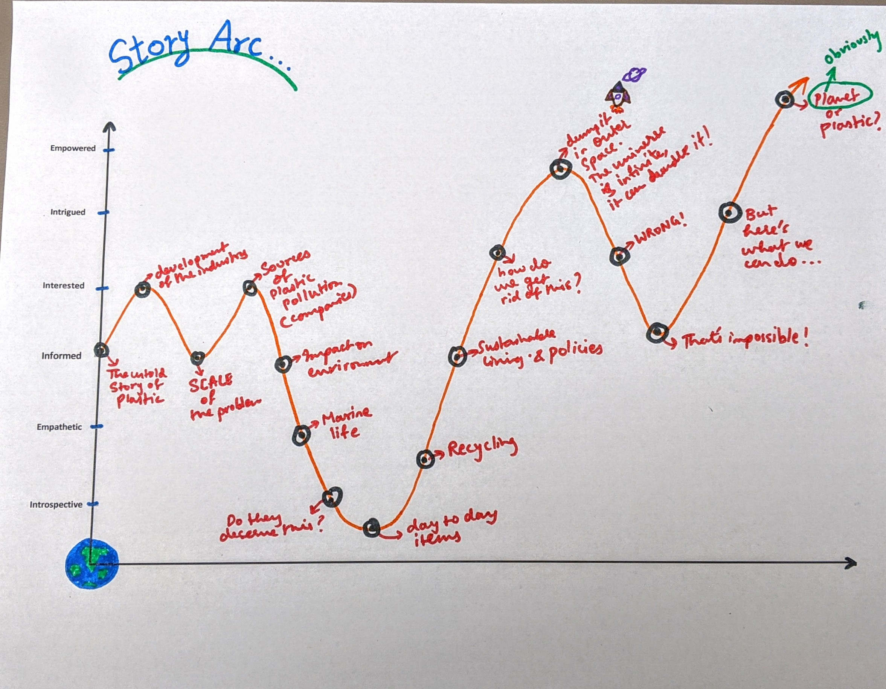

# Part I : Project Proposal

# 1. Outline
Proposal includes a high-level summary of the project (sentence or two); project structure that outlines major elements of the story; story arc is described; call to action is identified.

At a minimum, you should include the following: 

A high-level summary of your project.  This should be a sentence or two that describes what you're interested in showing with your final project.
A project structure that outlines the major elements of your story.  Your Good Charts text talks about story structure in Chapter 8 - you should describe the story arc that you hope to achieve.  Talk about the anticipated call to action and outline your user stories. 

## Summary : 

### "Plastic or Planet? The choice is easy but change is the challenge!"

For the final project I have chosen to focus on the problem of plastic pollution which prevails across our planet. I wish to convey the gravity of the problem to my audience by visualising and presenting data collected from reliable sources such as Nat Geo. Not only do I want to make people aware of the problem but also urge them to make small changes to their lifestyles that will contribute to the solution of this problem in a small but significant way.

## Inspiration :

This work is deeply inspired by National Geographics coverage of the problem and their initiatives to curb the menace. I watched a few documentaries which are part of **THE STORY OF PLASTIC** series that changed my mind. I want my work to have the same impact on my readers.

## Approach : 

- The untold story of plastic and its evolution  

-- How did this happen? When did all this begin?
- Putting this in perspective (discuss the scale at which plastic is produced and dumped) 

-- How big is this problem now? Why can't we just recycle
- How Plastic Pollution is affecting the Ocean Wildlife and other living creatures

-- Visuals and Data Visualizations
- Did you know...It is also taking human lives

-- Here's how and how many
- Okay Boomer!

--  We can do better, this is our world, it is in our hands now!
- Common things that are a huge cause of plastic pollution

-- Tooth brushes, plastic bags, sneakers, cigarettes

- The Universe is infinite why can't we trash our plastic there and rid the earth of it?

-- Not unless we have 33 Gazzillion Dollars lying around!

- These are the only plausible alternatives and the change begins with us!

- Call to action : Initiatives people can take or partake in

## Story Arc : 

## Understanding my audience : 

I have learnt through this class that it is essential to understand who our adiuence is in order to connect with them through our work and this is presicely why I have included this section. Well, I have had the privilege of sharing this class at Heinz with future ploicy makers and influencers. So I would like to use this as a thought provoking tool to convince people in this class as well as people across the globe to act fast on this issue. In order to alleviate this problem we are going to require policy reforms but before all that we have to take small steps as a citizens of this planet to do our bit. And this begins by understanding the problem and the fact that our contribution is an integral part of the solution.

## Here's what I want my reader to understand :

As a reader, I want **to be more cognizant of my impact on the environment** so that I can **do my bit to save the planet.**

## Call to Action : 

Take National Geographic's Pledge against Plastic and make a genuine effort to reduce your plastic consumption. Small changes will go a long way! 
As future policy makers and influencers we should all take actions in order to curb this plastic ma

It is time to say "Okay Boomer" and undo the damage done to our planet because of sheer neglect.

# 2. Initial Sketches
Clear and understandable sketches created and available on the Github page. Sketches mimic aspects of the outline and build on message. Story structure is built into sketches.
# 3. The Data
Data source identified. A copy of the data, or a recreated version of the data is available via a publicly-accessible link (Github, Box, or other publicly-accessible link). A couple of paragraphs that document data sources and how data will be used.

Data: [Google Sheets containing data](https://docs.google.com/spreadsheets/d/1AHCi-UIvZsHg_qm53ricrzInUJc23C5QepnS6lw2utg/edit?usp=sharing)

# 4. Method and Medium
A few paragraphs documenting how the project will be completed. Platform for the final project identified.

I will be completing the project in 4 steps

My method of story telling will be through persuasive imagery and persuasive data visualizations. I will incorporate the feedback I receive from my peers at each stage in order to make my work more effective and persuasive.

Having explored Shorthand and some really interesting content created using the platform, I have decided to build my final project using the tool. 

<- [Return to my Portfolio page](/README.md)
