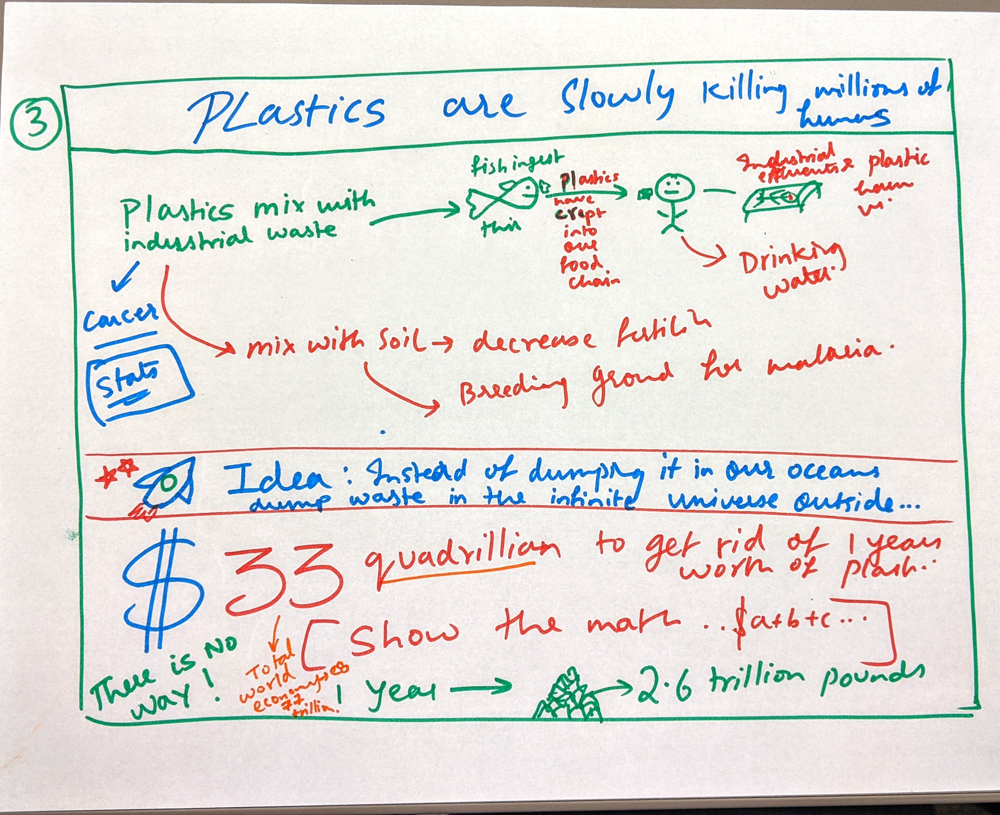

# Part I : Project Proposal

# 1. Outline

### "Plastic or Planet? The choice is easy but change is the challenge!"

## Summary : 

For the final project, I have chosen to focus on the problem of plastic pollution which prevails across our planet. I wish to convey the gravity of the problem to my audience by visualising and presenting data collected from reliable sources such as National Geographic, World Economic Forum, The telegraph and Oxford University's data source - Our world in Data. Not only do I want to make people aware of the problem but also urge them to make small changes to their lifestyles. This will contribute to the solution of this problem in a small but significant way and help curb this menace. Millions of sea creatures are falling prey to this and the numbers are on a horrific rise. The problem is more serious that it appears on the surface and I seek to take the audience right into the heart of the crisis so that they can choose for themselves, whether, Planet or Plastic!

## Inspiration :

This work is deeply inspired by National Geographic's coverage of the problem and their initiatives to curb the menace. I watched a few documentaries which are part of **THE STORY OF PLASTIC** series that changed my mind. I want my work to have the same impact on my readers.

## Approach : 

- The untold story of plastic and its evolution  
  - How did this happen? When did all this begin?
- Putting this in perspective (discuss the scale at which plastic is produced and dumped) 
  - How big is this problem now? Why can't we just recycle
- How Plastic Pollution is affecting the Ocean Wildlife and other living creatures
  - Visuals and Data Visualizations
- Did you know...It is also taking human lives
  - Here's how and how many
-Okay, Boomer!
  - We can do better, this is our world, it is in our hands now!
- Common things that are a huge cause of plastic pollution
  - Toothbrushes, plastic bags, sneakers, cigarettes
- The Universe is infinite why can't we trash our plastic there and rid the earth of it?
  - Not unless we have 33 Gazillion Dollars lying around!
- These are the only plausible alternatives and the change begins with us!
  - Policy Measures and simple steps like reduce, reuse, recylce
- Call to action
  - Initiatives people can take or partake in
  - PLEDGE AGAINST PLASTIC, join Nat Geo's initiative and do your part in saving the planet.

## Story Arc : 

## Feedback on Story Arc : 

- I really like the scale you've deviced for this story arc (well designed Y-axis) .
- Where do you think you want your Audience to focus? If there is just one take back for them, what would it be?

### Slightly modified Story Arc : 

More emphasis on the call for action : 

## Understanding my audience : 

I have learned through this class that it is essential to understand who our audience is, in order to connect with them through our work. I have had the privilege of sharing this class at Heinz with future policymakers and influencers. So, I would like to use this project as a thought-provoking tool to convince people in this class as well as people across the globe to act fast on the issue of Plastic Pollution. In order to alleviate this problem, we are going to require policy reforms but before all that, we have to take small steps and make immediate lifestyle changes as citizens of this planet to do our bit. This begins by understanding the problem and the fact that our contribution is an integral part of the solution.

## Here's what I want my reader to understand :

As a reader, I want **to be more cognizant of my impact on the environment** so that I can **do my bit to save the planet.**

## Call to Action : 

Take National Geographic's Pledge against Plastic and make a genuine effort to reduce your plastic consumption. Small changes will go a long way! 
As future policy makers and influencers we should all take actions in order to curb this plastic ma

It is time to say "Okay Boomer" and undo the damage done to our planet because of sheer neglect.

# 2. Initial Sketches

**1. Introduction: The Story of Plastic**

**2. Environmental Impact**

**3. Plastics are slowly killing Millions of Humans**

**4. Let us reflect on our consumption**

**5. Policy reforms required, the world scenario and simple steps we can take to save the planet**

**5. Call for Action - Pledge against Plastic!**

# 3. The Data

As mentioned previously, National Geographic's coverage of this issue inspired me to choose this topic. So, a lot of data that I will cite and visualise are from their website. In addition to that, I found other reliable sources that detail other facets of this mammoth problem. The final dataset used is a combination of all these sources. I intend on deriving my visualizations and some of my content from here.

**Data:** 

- [Google Sheets containing data](https://docs.google.com/spreadsheets/d/1AHCi-UIvZsHg_qm53ricrzInUJc23C5QepnS6lw2utg/edit?usp=sharing)

This google sheets link has data collected from multiple sources. Data from different sources are organised in different sheets and each of these sheets has a link to the data source.

It has 7 sheets in total, the first sheet is a list of all the data sources and their corresponding links. The remaining six contain the actual data. Another sheet appended at the end of this file contains names and sources of some images that I plan to use.

- [Our world in data - plastic pollution](https://ourworldindata.org/plastic-pollution)

This website contains data visualizations and data pertaining to the plastic pollution problem. It is sourced from Oxford University.

# 4. Method and Medium

## Method

I will be completing the project in 3 steps

My method of story telling will be through persuasive imagery and data visualizations. I will incorporate the feedback I receive from my peers at each stage in order to make my work more effective and persuasive.

------------------------------------------------------------------------------------------------------------------------------
**Step I:**  <------- We are here right now!
- Conduct thorough research on the topic of plastic pollution
- Outline key points that I would like to convey to the audience
- Collect Data from multiple sources, clean and compile it
- Based on the story I would like to share, chart a story arc which will give me a sense of the kind of effect I want each part of my work to have on my audience. 
- Get feedback on the story arc and see if the story is cohesive and engaging.
- Refine the story arc 
- Begin sketching key aspects of the project and piece all the information together.
- Rearrange some parts based on relevance and feedback received on the sketches.

------------------------------------------------------------------------------------------------------------------------------
**Step II:**

- Based on the feedback I receive on the sketches I will create wireframes for my final story
- Decide a color scheme and theme for the final output
- Refine and visualize the data collected using Tableau
- Experiment with shorthand and get familiar with the environment
- Come up with a first draft of the project using shorthand to get early feedback from peers

------------------------------------------------------------------------------------------------------------------------------
**Step III:**

- Use the 2 critiquing methods we have learned to identify shortfalls in the visualizations and take corrective action.
- Gauge the effectiveness of the story.
- Piece it all together on shorthand. 
- Design and create a digital story on shorthand using enticing visuals and imagery to depict the problem in all fairness.
- Check if the story is cohesive and engaging for a wide audience
- *Practice what I preach, reduce my plastic usage to a bare minimum!*

------------------------------------------------------------------------------------------------------------------------------

## Medium

 In order to create my visualizations, I will rely on **Tableau and RawGraphs**. To choose an apt color palette I will be using **Colorbrewer**. Finally, to piece it all together, I will use **Shorthand**, this is also the platform I will present my work on.

<- [Return to my Portfolio page](/README.md)
